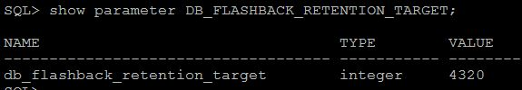

# Oracle Flashback Technology 
Use to recover data from Logical corruptions. Most of the Flashback technologies depend on the **UNDO** data to retrieve older data

## 1. Set Database Parameters 

- DB_FLASHBACK_RETENTION_TARGET: Time limit(minutes) for the deleted data to be retained
    
```SQL
 SQL> Alter System Set DB_FLASHBACK_RETENTION_TARGET=4320;
```
- DB_RECOVERY_FILE_DEST_SIZE: Size limit for the maximum data that can be retained.
   
```SQL
SQL> Alter System Set DB_RECOVERY_FILE_DEST_SIZE=2G;
```

- DB_RECOVERY_FILE_DEST: Location where the data needs to be retained.
    
```SQL
SQL> Alter System Set DB_RECOVERY_FILE_DEST='/Source/File/';
```

## 2. Check Database Parameters

```SQL
SQL> show parameter DB_FLASHBACK_RETENTION_TARGET;

NAME				     TYPE	 VALUE
------------------------------------ ----------- ------------------------------
db_flashback_retention_target	     integer	 4320

SQL> show parameter DB_RECOVERY_FILE_DEST_SIZE;

NAME				     TYPE	 VALUE
------------------------------------ ----------- ------------------------------
db_recovery_file_dest_size	     big integer 2G

SQL> show parameter db_recovery_file_dest;

NAME				     TYPE	 VALUE
------------------------------------ ----------- ------------------------------
db_recovery_file_dest		     string	 /ora01/app/oracle/fast_recovery_area
db_recovery_file_dest_size	     big integer 2G

SQL> show parameter undo_retention;

NAME				     TYPE	 VALUE
------------------------------------ ----------- ------------------------------
undo_retention			     integer	 900
```



```SQL
SQL> select TABLESPACE_NAME,RETENTION from dba_tablespaces where tablespace_name like 'UNDO%';

SQL> select log_mode,flashback_on from v$database;
```

## 3. Flashback Scenarios

### 3.1 DROP TABLE

Flashback drop is used to restore accidentally dropped tables and depended objects. After restoring the table will be renamed as its original whereas the indexes will have system generated names. Using `select * ` command

**Before doing flashback, confirm that the dropped object has not been purged**

```SQL

FLASHBACK TABLE EMP2 TO BEFORE DROP;
```
### CASE 1. TABLES WITHOUT INDEXES

```SQL
SQL> select table_name from user_tables;

SQL> create table emp2 as select * from emp1;

SQL> drop table emp2;

SQL> select * from emp2;

ORA-00942: table or view does not exist

SQL> select object_name,original_name from recyclebin;

SQL> flashback table emp2 to before drop;

SQL> select * from emp2;

SQL> select object_name,original_name from recyclebin;

```
*CASE 2. TABLES WITH INDEXES*

SQL> create index ind3 on t1(id);

SQL>  select table_name,index_name from user_indexes where index_name='IND3';

SQL> drop table t1;

SQL> flashback table t1 to before drop;

SQL> select table_name,index_name from user_indexes where index_name='IND3';

SQL> select table_name,index_name from user_indexes where table_name like 'T1';

SQL> alter index "BIN$ejoy9vcUJn7gVAAUT/jf3w==$1" rename to IND3;

SQL> select table_name,index_name from user_indexes where index_name='IND3';

**3.2 ORACLE FLASHBACK VERSION QUERY**

This feature helps to view all the versions of all the rows that ever existed in one or more tables in between two points in time or system change numbers (SCN).This feature also depends on UNDO data.

(Update table row several times and flashback)

Syntax:

Select .. Versions Between SCN | Timestamp And SCN | Timestamp

Select Version_Xid,Dept_Id
From Dept
Version Between SCN (Referencing A Start And End SCN);
```SQL
Select Version_Xid,Dept_Id
From Dept
Version Between TIMESTAMP (Referencing A Start And End Timestamp);
```

SQL> select * from emp3;

SQL> update emp3 set salary=19900 where id=3;

SQL> commit;

SQL> update emp3 set salary=27700 where id=3;

SQL> commit;


Markdown | Less | Pretty
--- | --- | ---
*Still* | `renders` | **nicely**
1 | 2 | 3


SQL> col versions_starttime for a27

SQL> col versions_endtime for a27

SQL> select * from emp3;

SQL> select versions_starttime,versions_endtime,id,salary from emp3 versions between scn minvalue and maxvalue where id=3;

SQL> select versions_startscn,versions_endscn,id,salary from emp3 versions between scn minvalue and maxvalue where id=3;

SQL> select * from emp3 as of timestamp TO_TIMESTAMP('2018-11-10 09:07:00','YYYY-MM-DD HH24:MI:SS');

SQL> select id,salary from emp3 as of scn 3080310 where id=3;

SQL> flashback table emp3 to scn 3080310;

ORA-08189: cannot flashback the table because row movement is not enabled

SQL> alter table emp3 enable row movement;

SQL> flashback table emp3 to scn 3080310;

SQL> select * from emp3;


